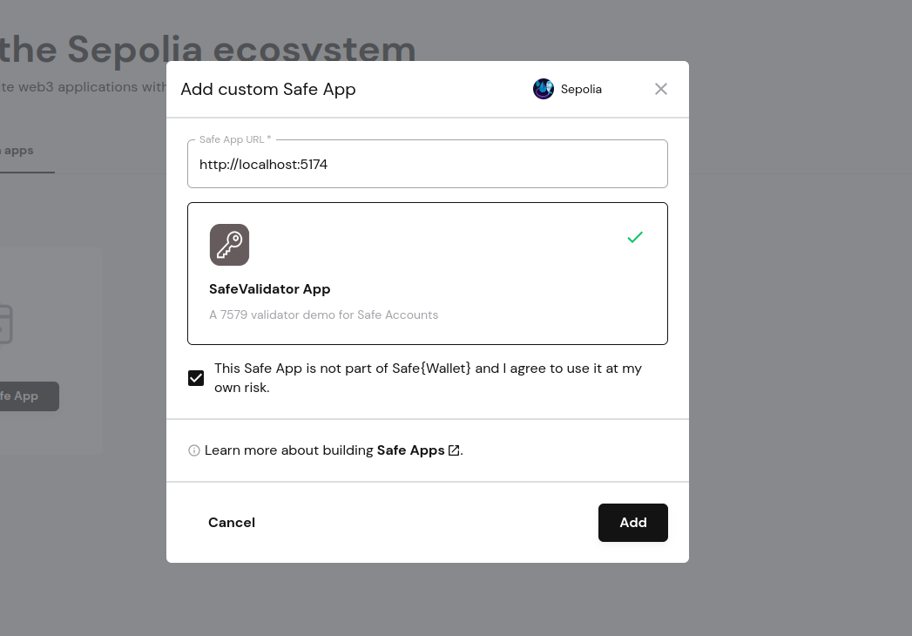
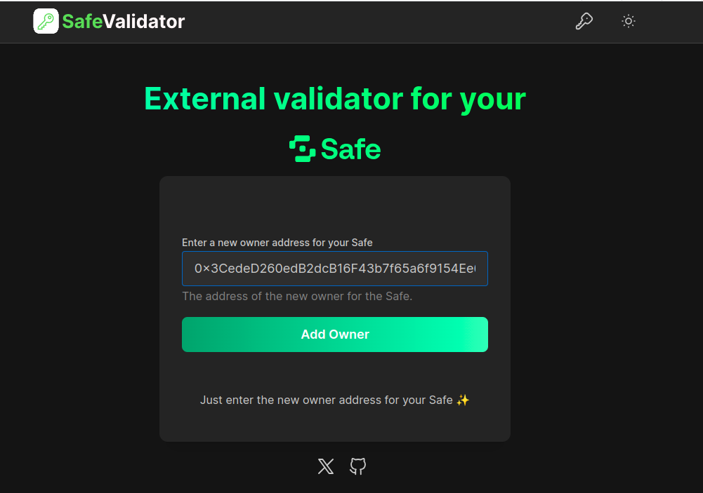
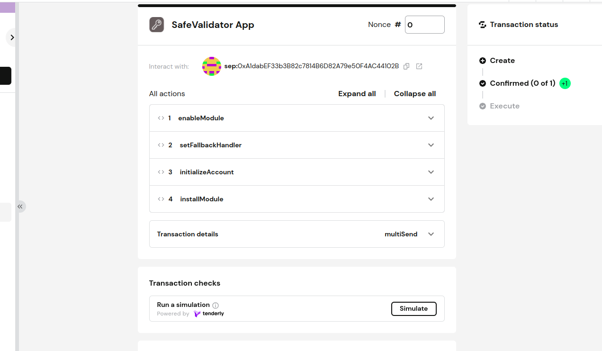
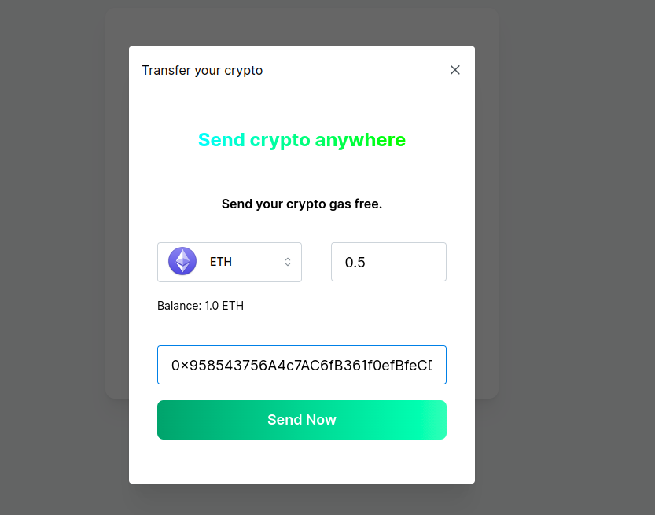
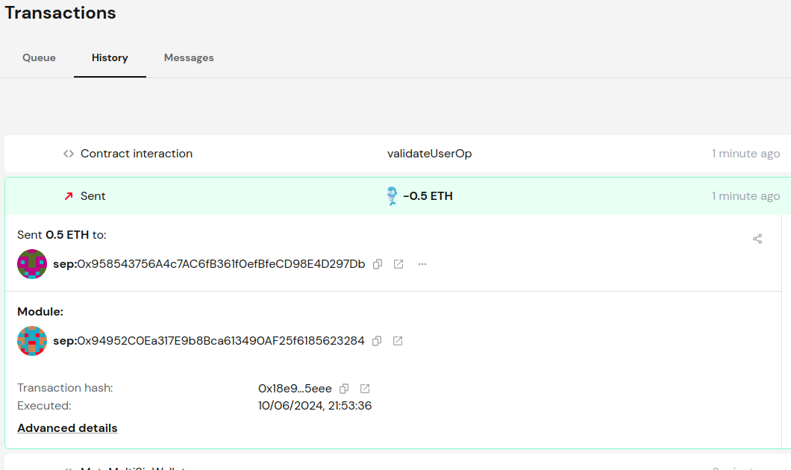

# Tutorial to build a validator and enable on Safe Account

In this tutorial, we will create a basic 7579 validator module. This module can be installed into a Safe Account using the Safe 7579 adapter, enhancing the validation flow of the Safe Account.


## Getting started:

Before we install and enable any modules for Safe Accounts, they need to be developed and thoroughly tested. Once developed, these modules can be installed on either an existing or a new Safe Account.

In this tutorial, We will make use of a validator called [OwnableValidator](https://github.com/rhinestonewtf/core-modules/blob/main/src/OwnableValidator/OwnableValidator.sol) by Rhinestone. This validator will have the capability to add a new owner or multiple owners and verify transactions for an existing Safe Account.


### Step 1: Clone the module template repository:

```bash [Terminal] 
git clone https://github.com/koshikraj/module-template-7579.git
```

To simplify the development, let's start with a module template that comes with all the necessary dependencies pre-installed. This module package combines both Hardhat and Foundry projects for a streamlined setup.

### Step 2: Build the validator module

We will use the ownable validator that is compliant with the 7579 standard to accomplish the following tasks:

1. Adds a new owner address to the Safe by mapping it to the account address when installing the module.
2. Implements validation logic in the validateUserOp method to ensure the transaction is signed by the added owner.
3. Removes the new owner address mapped to the Safe account address when uninstalling the module.

Find the entire code of [OwnableValidator here](https://github.com/rhinestonewtf/core-modules/blob/main/src/OwnableValidator/OwnableValidator.sol).

Here is the basic structure of module code with validation that achieves these requirements:

```ts  [ OwnableValidator.sol ]

/**
 * @title OwnableValidator
 * @dev Module that allows users to designate EOA owners that can validate transactions using a
 * threshold
 * @author Rhinestone
 */
contract OwnableValidator is ERC7579ValidatorBase {


        /**
     * Validates a user operation
     */
    function validateUserOp(                                      
        PackedUserOperation calldata userOp,                      
        bytes32 userOpHash                                              
    )                                                                              
        external                                                 
        view                                                         
        override                                                          
        returns (ValidationData)                                        
    {
        // validate the signature with the config                          
        bool isValid = _validateSignatureWithConfig(userOp.sender, userOpHash, userOp.signature);     

        if (isValid) {                                                
            return VALIDATION_SUCCESS;                                
        }                                                                 
        return VALIDATION_FAILED;                                         
    }                                                                    


    function _validateSignatureWithConfig(
        address account,
        bytes32 hash,
        bytes calldata data
    )
        internal
        view
        returns (bool)
    {

    }


    /**
     * Initializes the module with the threshold and owners
     */
    function onInstall(bytes calldata data) external override {

    }

    /**
     * Handles the uninstallation of the module and clears the threshold and owners
     */
    function onUninstall(bytes calldata) external override {

    }

    /**
     * Checks if the module is initialized
     */
    function isInitialized(address smartAccount) public view returns (bool) {
        return threshold[smartAccount] != 0;
    }

    /**
     * Sets the threshold for the account
     */
    function setThreshold(uint256 _threshold) external {

    }

    /**
     * Adds an owner to the account
     */
    function addOwner(address owner) external {

    }

    /**
     * Removes an owner from the account
     */
    function removeOwner(address prevOwner, address owner) external {

    }

    /**
     * Returns the owners of the account
     */
    function getOwners(address account) external view returns (address[] memory ownersArray) {
        // get the owners from the linked list
        (ownersArray,) = owners.getEntriesPaginated(account, SENTINEL, MAX_OWNERS);
    }


    /**
     * Returns the type of the module
     */
    function isModuleType(uint256 typeID) external pure override returns (bool) {
        return typeID == TYPE_VALIDATOR;
    }

    /**
     * Returns the name of the module
     */
    function name() external pure virtual returns (string memory) {
        return "OwnableValidator";
    }

    /**
     * Returns the version of the module
     */
    function version() external pure virtual returns (string memory) {
        return "1.0.0";
    }
}

```

You can now build and test this code against the Safe Account by placing it under the module/contracts directory.

```txt [ Project structure]
module-template-7579/
├── module/         
|   └── contracts/   
└──  web/
```

Make sure the module can build without any errors inside the project.

```bash [Terminal]
npm run build
```

### Step 3: Test the validator module


The validator module can be tested against Safe using the 7579 adapter. The test setup automatically handles adding the 7579 adapter as the fallback handler and module to the Safe.

To test our validator module against Safe, follow these steps

1. **Install the Validator Module:** Use the Safe 7579 adapter to install the validator module by passing the owner address and module code, which is 1 for the validator.
2. **Construct the Nonce:** Add the validator address as the key to construct the nonce.
3. **Build the User Operation:**  Create the User Operation and send it, appending the valid signature that the validator will verify.


```ts  [ OwnableValidator.t.sol ]

    await execSafeTransaction(safe, 
    await safe7579.initializeAccount.populateTransaction([], [], [], [], {registry: ZeroAddress, attesters: [], threshold: 0}));  

    await execSafeTransaction(safe, 
    {to: await safe.getAddress(),  
    data:  ((await safe7579.installModule.populateTransaction(1, await ownableValidator.getAddress(), utils.defaultAbiCoder.encode(['uint256', 'address[]'], [1, [user1.address]]))).data  as string),  
    value: 0}) 

    const key = BigInt(pad(await ownableValidator.getAddress() as Hex, {  
        dir: "right",
        size: 24,
      }) || 0
    ) 
    const currentNonce = await entryPoint.getNonce(await safe.getAddress(), key);  


    let userOp = buildUnsignedUserOpTransaction(await safe.getAddress(), currentNonce, call) 

    const typedDataHash = ethers.getBytes(await entryPoint.getUserOpHash(userOp))
    userOp.signature = await user1.signMessage(typedDataHash)
```


You can now test the validator module against the Safe Account by placing the test script under the module/test directory. 

```txt [ Project structure]
module-template-7579/
├── module/        
|   └── test/ 
└── web/
```

After setting up the validation test flow, you can run the tests to ensure everything is working correctly. 

```bash [Terminal]
npm run test


Safe7579 - Basic tests

3 passing (200ms)
```


### Step 4: Install the validator module to Safe Account using a Safe App
 
Now that you have thoroughly tested the validator code, you can proceed to deploy the validator module and integrate it with a Safe Account. Follow these steps to deploy the validator module and use it on a Safe Account:

```bash [Terminal]
npm run deploy sepolia

depolyed "Safe7579" at 0x94952C0Ea317E9b8Bca613490AF25f6185623284
depolyed "OwnableValidator" at 0xe90044FE8855B307Fe8F9848fd9558D5D3479191

```


To add the validator to the Safe Account using a Safe App via Safe {Wallet}, you can build a custom Safe App using the provided template from your code base. Follow these steps to create and deploy the Safe App:

```txt [ Safe App structure]
web/src/
├── logic/
|   └── module.ts
├── pages/ 
└── utils/
``` 

Replace the deployed Safe7579 and OwnableValidator contract addresses to add and interact with the module. 

The Safe App can be added to the Safe {Wallet} as a custom Safe App.



Here is the snippet of code that
1. Enables Safe7579 adapter as a module and fallback handler.
2. Initializes the Safe7579 account.
3. Installs the validator.

```ts  [ module.ts ]


export const addValidatorModule = async (ownerAddress: Hex ) => {
    
    if (!await isConnectedToSafe()) throw Error("Not connected to a Safe")

    const info = await getSafeInfo()

    const txs: BaseTransaction[] = []


    if (!await isModuleEnabled(info.safeAddress, safe7579Module)) {
        txs.push(await buildEnableModule(info.safeAddress, safe7579Module))
        txs.push(await buildUpdateFallbackHandler(info.safeAddress, safe7579Module))
        txs.push(await buildInitSafe7579())
 
        txs.push(await buildOwnableInstallModule([ownerAddress], 1))
    }
    else if(!await isInstalled(OWNABLE_VALIDATOR_ADDRESS, 'validator')) {    
        txs.push(await buildOwnableInstallModule([ownerAddress], 1))       

    }

    if (txs.length > 0)  
    await submitTxs(txs)
}

```

Here is snippet of code that creates the transaction required to install the validator module. We are making use 
of [module-sdk](https://docs.rhinestone.wtf/module-sdk/getting-started) by Rhinestone to achieve this.

```ts [ module.ts]


    const provider = await getProvider()
    const safeInfo = await getSafeInfo()
    
    // Updating the provider RPC if it's from the Safe App.
    const chainId = (await provider.getNetwork()).chainId.toString()

    const client = getClient({ rpcUrl: NetworkUtil.getNetworkById(parseInt(chainId))?.url!});

    // Create the account object
    const account = getAccount({    
            address: safe7579Module,
            type: "safe",
        });

    const ownableValidator = getInstallOwnableValidator({   
        owners: owners,                                         
        threshold: threshold, // owners threshold             
      });                                                         

    const executions = await installModule({                       
        client,                                                   
        account,                                                  
        module: ownableValidator,                                        
      });

    return { to: safeInfo.safeAddress , value: executions[0].value.toString() , data: executions[0].callData }

}

```


We can now use execute these transaction using Safe App. Before the OwnableValidator is installed on our Safe Wallet, we just need to provide the owner address that needs to be added.



The Safe App will then enable the Safe 7579 adapter as module and fallback handler along with installing the validator.




###  Step 5: Use the Safe Account via new validator

Now that the validator module has been installed via Safe 7579 adapter, it can be validated via the new owner.
As the Safe Account is fullt compliant with the ERC-4337, thanks to the adapter, we can create and execute transactions via User Operations via bundlers.

Here is how we can contruct the user operation for the Ownable validator and execute it.


```ts  [ module.ts ]

export const sendTransaction = async (chainId: string, recipient: string, amount: bigint, walletProvider: any, safeAccount: string): Promise<any> => {

    const call = { target: recipient as Hex, value: amount, callData: '0x' as Hex }

    const key = BigInt(pad(ownableModule as Hex, {
        dir: "right",
        size: 24,
      }) || 0
    )
    
    const nonce = await getAccountNonce(publicClient(parseInt(chainId)), {
        sender: safeAccount as Hex,
        entryPoint: ENTRYPOINT_ADDRESS_V07,
        key: key
    })

    let unsignedUserOp = buildUnsignedUserOpTransaction(
        safeAccount as Hex,
        call,
        nonce,
      )

      const signUserOperation = async function signUserOperation(userOperation: UserOperation<"v0.7">) {

        const provider = await getJsonRpcProvider(chainId)
    
        const entryPoint = new Contract(
            ENTRYPOINT_ADDRESS_V07,
            EntryPoint.abi,
            provider
        )
        let typedDataHash = getBytes(await entryPoint.getUserOpHash(getPackedUserOperation(userOperation)))
        return await walletProvider.signMessage(typedDataHash) as `0x${string}`
    
    }

    const userOperationHash = await sendUserOperation(chainId, unsignedUserOp, signUserOperation )

    return userOperationHash;
}
```



As soon as the transaction is executed, it can be verified via the Safe {Wallet} transactions.



Hope this tutorial was helpful to kickstart the module development. 

## More module usecases

-  [ZeroDev passkey validator for Safe](https://github.com/koshikraj/safe-passkey-validator) ([Demo](https://youtu.be/G7hQw_v780I))
-  [Sub Account for Safe](https://github.com/koshikraj/safe-subaccount) ([Demo](https://youtu.be/_4BDcQiIUvo))
-  [Share crypto via links - Session Key](https://github.com/koshikraj/safelink)  ([Demo](https://youtu.be/iVxuDs-usVQ))


## Essential Links

- [Rhinestone Module Kit](https://github.com/rhinestonewtf/modulekit/tree/main) - *Repo*
- [Module template](https://github.com/rhinestonewtf/module-template) - *Repo*
- [How to build a module](https://docs.rhinestone.wtf/modulekit/build/module-basics) - *Docs*
- [7579 Module template](https://github.com/koshikraj/module-template-7579)
- [ERC 7579](https://erc7579.com)


